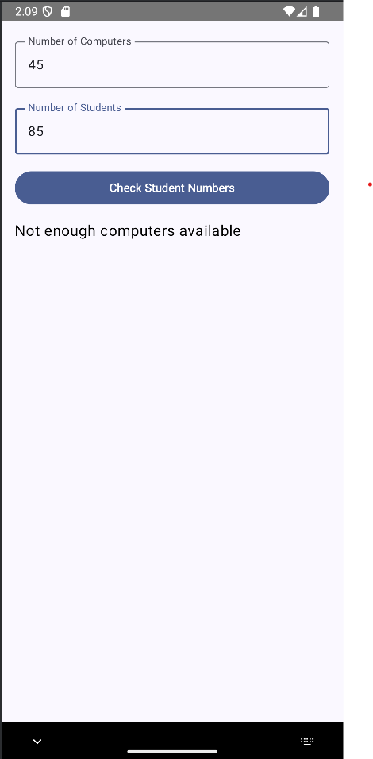
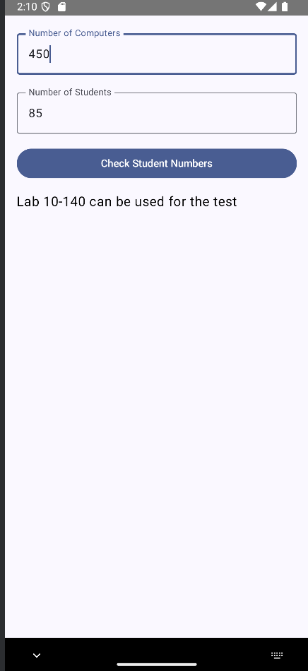

# Lab Computer Checker

A simple Android app built with Jetpack Compose to check if a computer lab has enough computers for a given number of students.

## Features

- Input the number of available computers.
- Input the number of students needing computers.
- Check availability with a button press.
- Displays a clear message indicating if the lab can be used.

## How It Works

1. Enter the number of computers in the lab.
2. Enter the number of students expected.
3. Tap **Check Student Numbers**.
4. The app compares the numbers and displays:
   - "Lab 10-140 can be used for the test" if there are enough computers.
   - "Not enough computers available" if there aren’t.

## Screenshots

|  Result Screen                    | Result Screen                   |
| ------------------------------ | ------------------------------ |
|        |       |

*Make sure `pic1.png` and `pic2.png` are included in your repo.*

## Technologies Used

- Kotlin
- Android Jetpack Compose
- Material3 components

## Getting Started

1. Clone this repository:
   ```bash
   git clone https://github.com/Sekomane/Lab-Computer-Checker.git
